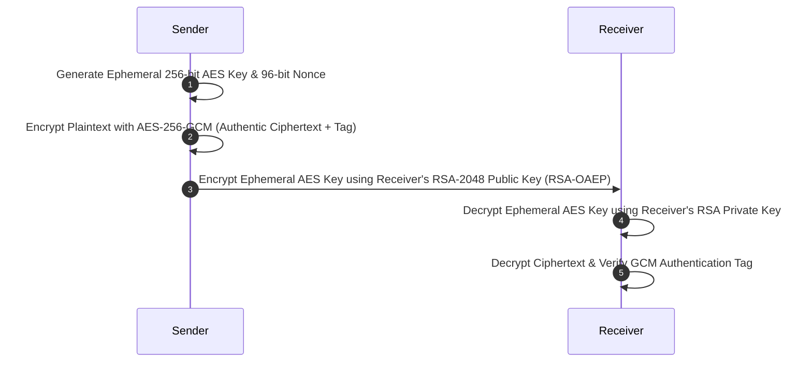
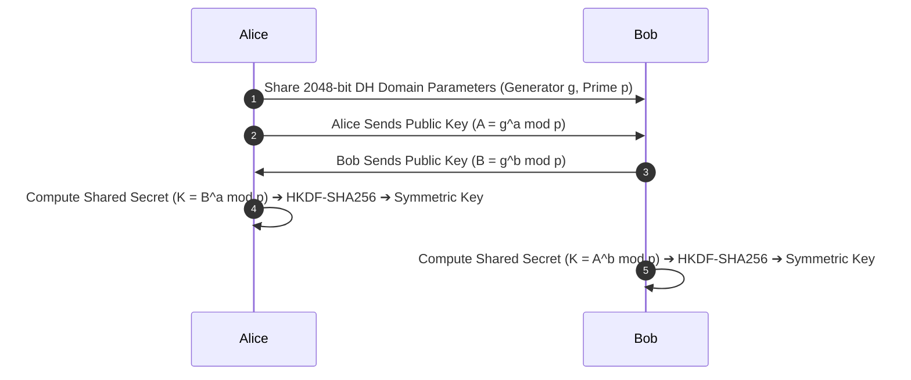

# NIST Cryptographic Standards Suite (Python)

[](https://github.com/tahniatfarhan/nist-cryptographic-standards-suite/actions/workflows/ci.yml)
[](https://github.com/tahniatfarhan/nist-cryptographic-standards-suite/actions/workflows/codeql.yml)
[](https://opensource.org/licenses/MIT)
[](https://www.python.org/)
[](https://csrc.nist.gov/)

> 🎓 **Academic Project Disclaimer:** This repository is an **educational laboratory demonstration suite** developed for the Cryptography / Cyber Security course in the BS Cyber Security degree program at UET Lahore. It demonstrates core cryptographic algorithms, key exchange, digital signatures, PKI, and symmetric/asymmetric ciphers using PyCA `cryptography`.

---

## 📐 Cryptographic System Architecture

### 1. Hybrid Encryption Flow (RSA-OAEP + AES-256-GCM)
The hybrid encryption pipeline demonstrates how modern security protocols (such as TLS/HTTPS and PGP) securely transport confidential data:



### 2. Diffie-Hellman Key Exchange (NIST SP 800-56A)


---

## 📜 Supported NIST & FIPS Standards

| Module | Primitive / Algorithm | Standard Reference | Security Status |
|---|---|---|---|
| **Diffie-Hellman** | DH 2048-bit MODP + HKDF | NIST SP 800-56A / RFC 5869 | ✅ Approved |
| **RSA Key Generation** | RSA-2048 Key Pair | NIST SP 800-56B / FIPS 186-4 | ✅ Approved |
| **Digital Signature** | RSA-PSS with SHA-256 | FIPS 186-4 | ✅ Approved |
| **Digital Certificate** | X.509 v3 Self-Signed PKI | RFC 5280 / PKI | ✅ Approved |
| **AES Encryption** | AES-256-GCM (Authenticated) | FIPS 197 / NIST SP 800-38D | ✅ Approved |
| **Hybrid Encryption** | RSA-OAEP + AES-256-GCM | TLS 1.3 / HTTPS Basis | ✅ Approved |
| **Triple DES (3DES)** | 3DES CBC (Legacy 168-bit) | NIST SP 800-67 | ⚠️ **Legacy Deprecated** (Post-2023) |
| **One-Time Pad** | OTP XOR Cipher | Information-Theoretic Security | ℹ️ Theoretical Demo |

---

## 📁 Package & Directory Structure

```
nist-cryptographic-standards-suite/
├── .github/
│   ├── dependabot.yml              # Automated monthly dependency update scanner
│   └── workflows/
│       ├── ci.yml                  # Pytest runner across Python 3.10, 3.11, 3.12
│       └── codeql.yml              # GitHub CodeQL Static Security Analysis
├── certs/
│   └── certificate.pem             # Exported X.509 Certificate artifact
├── keys/
│   ├── rsa_private.pem             # Exported RSA Private Key artifact
│   └── rsa_public.pem              # Exported RSA Public Key artifact
├── signatures/
│   ├── message.txt                 # Original signed message
│   └── signature.sig               # Raw signature binary artifact
├── src/
│   ├── app.py                      # Backward-compatible thin entry point wrapper
│   └── nist_crypto/                # Modular Cryptographic Package
│       ├── __init__.py             # Package metadata
│       ├── ciphers.py              # AES-256-GCM, 3DES Legacy, OTP modules
│       ├── cli.py                  # CLI argument parser & demonstration output
│       ├── dh.py                   # Diffie-Hellman & HKDF key derivation
│       ├── pki.py                  # X.509 Certificate Generator
│       └── signatures.py           # RSA Keygen, RSA-PSS, Hybrid RSA+AES
├── tests/
│   └── test_nist_vectors.py        # Pytest test suite verifying KAT vectors & edge cases
├── CODE_OF_CONDUCT.md              # Contributor Code of Conduct
├── CONTRIBUTING.md                 # Contribution Guidelines
├── LICENSE                         # MIT License
├── pyproject.toml                  # Standard Python PEP 517/518 build configuration
├── README.md                       # Documentation & Architecture Overview
├── requirements.txt                # Production & test dependencies
└── SECURITY.md                     # Security reporting policy
```

---

## 🛡️ Security & Cryptographic Best Practices

1. **Explicit Tag Verification:** AES-256-GCM mode validates authenticity tags on decryption, throwing `InvalidTag` on payload or tag tampering.
2. **Proper Randomness:** Nonces (96-bit for GCM, IVs for 3DES) and keys are generated using system CSPRNG (`os.urandom()`).
3. **No Private Key Logging:** Private key materials are never printed or output to unencrypted logs.
4. **Explicit 3DES Deprecation Notice:** Triple DES is isolated in `ciphers.py` with explicit warnings documenting its deprecation per NIST SP 800-67.

---

## 🛠️ Installation & Execution

### 1. Installation
Clone the repository and install in editable mode:

```bash
git clone https://github.com/tahniatfarhan/nist-cryptographic-standards-suite.git
cd nist-cryptographic-standards-suite
pip install -e .[dev]
```

### 2. Run Demonstrations

```bash
# Execute all cryptographic demonstrations (Backward compatible entry point)
python src/app.py

# Or run via module CLI parser
python -m nist_crypto.cli --demo all
```

### 3. Run Automated Pytest Suite

```bash
pytest -v tests/
```

---

## 📄 License & Author

Distributed under the **MIT License**. See [`LICENSE`](LICENSE) for details.

**Author:** [Tahniat Farhan](https://github.com/tahniatfarhan) — BS Cyber Security, UET Lahore.
